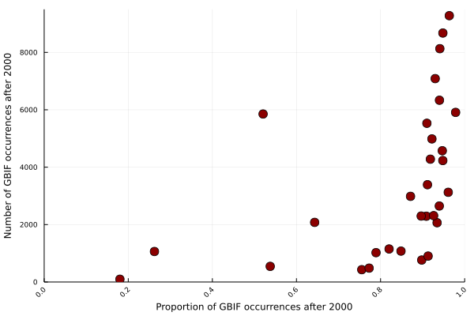

Dear editor,

Thank you for the inviting a specialist on large scale biodiversity patterns of
Africa to review our manuscript. We were happy to see that the first reveiwer
was satisfied with our response, and that the second reviewer also saw value in
our contribution. The new comments were very pertinent and we hope that this
letter and the changes we've made to the paper are satisfactory.  

We have improved the text in order to avoid misleading phrasing. For example, we
understand that using the words "updated ranges" can be read as distribution
modelling, which is not the case: here, we simply use a method to identify areas
where the predator range does not match with their prey's range, which might
indicate distribution uncertainty areas.  

We have also addressed reviewer's concerns about the GBIF data (see below): our
investigations show that most of the data we were using are recent (from the
last 20 years). We decided to add a threshold on the year 2000 and restrict the
time extension of our query the same way we do for the geographical extension -
not as a filtering step in terms of Ecology, but of likelyhood of getting the
most accurate data. Any refined filtering other than that would hinder the goals
of our paper. Finally, we have improved the methods and the discussion sections
to include more detailed descriptions of the data being used and to give more
context to the results. We detail specific changes below (line numbers refer to
the clean, revised PDF file).

>*"1. In the extent of the study, the authors mention that they “restricted the
>rasters a spatial extent comprised between latitudes 35°S and 40°N and
>longitudes 20°W and 55°E. “ – which is the whole of Africa. Since the study
>uses a dataset from Tanzania (Serengeti food web dataset), roughly 3% of the
>continent, how did the authors deal with the presence of putative prey items in
>other parts of the continent that are absent from the Serengeti food web
>dataset? For example Papio ursinus, Sylvicapra caffra and S. grimmia don't
>occur in Tanzania but are prey items to many carnivores in Africa."*  

>*"5. Taxonomic groups: Carnivores feed on a diversity of items, beyond
>herbivores. Their diet might include birds, fish, reptiles, amphibians, and
>even invertebrates. How did the authors account for the fact that despite
>missing the herbivores from Serengeti, there were other sources of protein that
>could sustain the species in the continent?"*

We have found that these two comments address the same issue: the
representativity of the Serengeti foodweb. First, we would like to emphasize
that our analysis is meant to be a proof of concept, showing the consequences of
data limitation. Therefore, rather than trying to gather an exhaustive foodweb
dataset - with information for all possible interactions for all occurring
mammals in the African continent -, we looked for a very complete, readily
available, widely used and well known dataset which could represent the main
interactions in that area. Interaction data is difficult to collect, especially
at broad scales. Because of that, we expected that no foodweb would be complete,
and we are aware of the biases of our interactions data. However, the goal of
this paper is to investigate precisely what happens if we need to deal with
incomplete and biased datasets, because we believe that this might lead us to
describe unrealistic ecological communities at the local scale. More than that,
we believe that data incompleteness is not a limitation of our study, but one of
its strengths, because we present a simple method to identify and describe these
limitations.

That being said, the foodweb database that we chose is known for being
representative for these animals on the whole African continent (as we can see,
for example, in de Visser, Freymann and Olff, 2011). Although our dataset miss a
few links, again, it was not our goal to make a comprehensive analysis of all
the area where a predator would miss a prey based on all the knowledge available
or not, but rather demonstrate what can happen if we deal with incomplete
datasets, highlight the importance of accounting for uncertainty when dealing
with species distribution data, and call to attention the need to make more
interaction data open. Moreover, many of the prey items on Baskerville's dataset
were also found outside the Serengeti park area, and our method only needed one
link connecting a predator to a herbivore to "keep" a pixel from a predator's
range. Therefore, the impact of the missing links on the foodweb should be of
great magnitude to invalidate our methods.

Finally, some of the results we highlight would not change with the addition of
new prey items. For example, the *Canis aureus* results are due mainly to an
apparent taxonomic disagreement - which is indeed connected to its interaction
data, but this would not change with a more complete list of preys for this
species.

To emphasize and clarify these points, we have changed lines 83-86 and 171-175 on
the manuscript.

>*"4. The gbif records for large mammals are especially problematic. Did the
>authors include observations as well? iNaturalist for instance now feeds data
>directly to GBIF. Having museum specimens of lions and other large/medium
>mammals are especially problematic and difficult to achieve nowadays. Many
>countries such as Malawi and Mozambique conduct very little research and many
>areas are not documented, not even on GBIF. Therefore the occurrences we see on
>GBIF are biased towards countries that have available data. How did the authors
>account for this? See https://doi.org/10.1093/sysbio/syaa090"*

Similar to the questions above, this one is also about incompleteness of data.
As we stated on our previous review letter, "we didn't perform any [...] data
cleaning procedures because this could hinder the goals of the paper, which was
to investigate the characteristics of the data available for research. As we
needed to compare two sets of raw data, and data cleaning protocols are
dependent on the use objectives, we chose to avoid data manipulation both for
GBIF and IUCN datasets". For that reason, our query for the GBIF data did not
include any filters other than the ones described on the paper for the reasons
listed above.  

Additionally, we could add a plethora of other datasets both on
interactions and occurrences, but we decided to use only the IUCN, the GBIF and
the Baskerville's data to keep the analysis simple (although not simplistic),
straightforward, and reflective of the volume of data generally used by
ecologists.  

Finally, the fact that many data are still to be made open is precisely the
major motivation of this paper. As computational ecologists and open data
creators/managers/advocates, we are very aware of the biases produced by
undocumented data. We expect to call attention about this issue with our proof
of concept, as it demonstrates that we gain a lot of uncertainty when we miss a
link because of an information that is not accessible. The implications of this
complex issue for conservation are multifold, and we believe that more open data
is one of the possible solutions.

>*"2.    The resolution: it is well studied that IUCN range maps should not be
>converted to grids smaller than 50km due to commission errors. This becomes a
>major problem when dealing with widespread species such as the ones used in
>this study: African large and medium mammals. See
>https://doi.org/10.1111/1365-2664.12771 and
>https://doi.org/10.1073/pnas.070446910"*

We agree and we have updated our rasters to be now at 50km of resolution. Our
overall results did not change with that (see line 125 and Results section,
especially Table 1).

>*"3. Gbif records: using records from any period in time from gbif will include
>historical relics from extinct populations. Many large and medium mammals,
>especially large carnivores have suffered major declines in the last decades in
>Africa. How did the authors deal with the fact that records from a species
>recorded 50 years ago may represent extinct populations?"*

This is a very interesting comment and we have explored the temporal
distribution of the GBIF records we have retrieved. As you can see below, most
of the data is recent, from after the year 2000. This means that our previous
results are very likely to represent our current state of biodiversity
(considering a temporal autocorrelation effect). However, we agree that extinct
populations could be a real problem for the validation step of our method, and
therefore we decided to add a temporal restriction to our query. We have then
re-run our analyses with only GBIF occurrences registered after the year 2000.
Still, our results are overall the same. We have updated the absolute values on
lines 212-215, 225-228, 259, 274-275, and 285-289.

We hope our revised manuscript is now more appropriate for publishing at PeerJ.
Reiterating our appreciation for yours and the reviewer's thoughtful comments,
we are available to answer any further questions.

Best regards,  
The Authors
